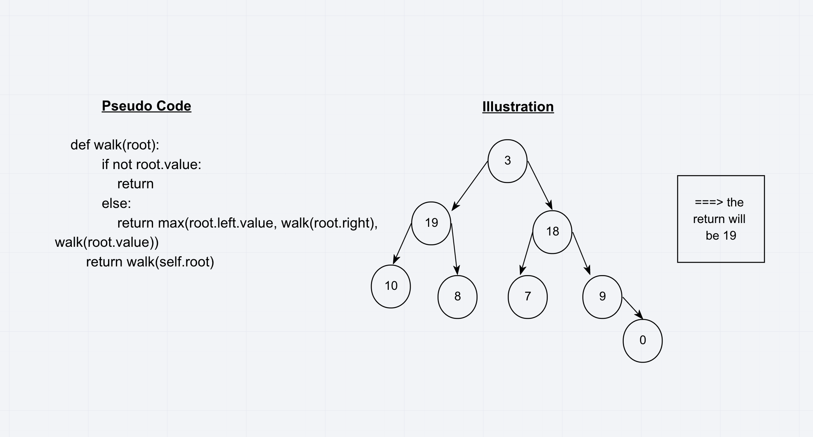

# Challenge Summary
Write an instance method called find-maximum-value. Without utilizing any of the built-in methods available to your language, return the maximum value stored in the tree. You can assume that the values stored in the Binary Tree will be numeric.

## Approach & Efficiency
This challenge prompt us to write a recursive function that will find the max value of the root, left and right node. it will be then O(logN)
## Solution

